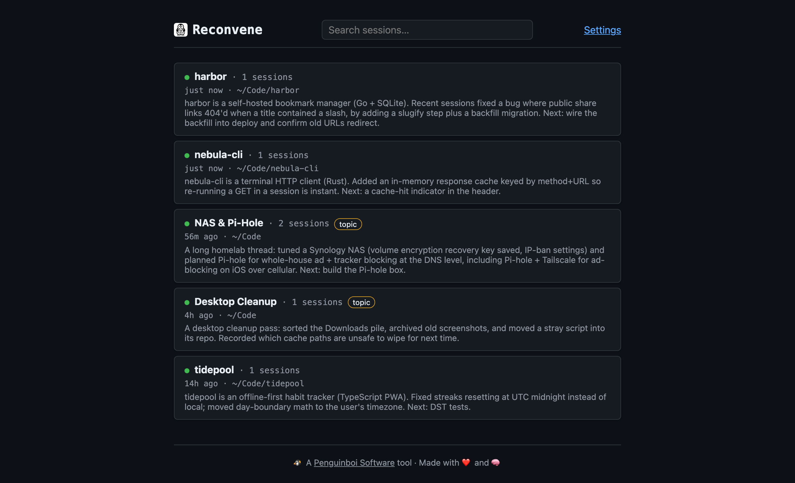
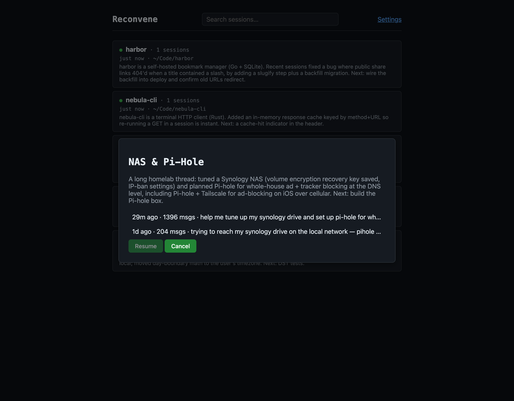
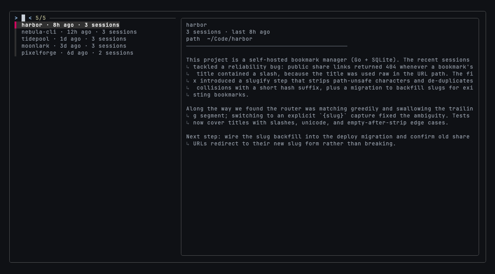

# Reconvene

Resume your Claude Code sessions from a browser tab. Reads
[ccrider](https://github.com/neilberkman/ccrider)'s session database, ranks your
projects by recent activity, and lets you pick up where you left off.



Each project shows an AI-generated recap of your recent sessions, so you can tell at a
glance what you were doing before you pick one to resume. Sessions launched from a bare
directory like `~/Code` are clustered into named **topic groups** (the `topic` tags above).

## Requires

- [ccrider](https://github.com/neilberkman/ccrider): `brew install neilberkman/tap/ccrider`
- The `claude` CLI (Claude Code), logged in
- macOS or Linux — the web GUI resumes by opening a new terminal window (macOS Terminal/iTerm2
  via AppleScript; on Linux, `$TERMINAL` or a detected emulator such as gnome-terminal, konsole,
  alacritty, kitty, or xterm). The TUI resumes in place and works anywhere.
- [fzf](https://github.com/junegunn/fzf) — only for the terminal picker: `brew install fzf`

## Install

Install the `reconvene` command with pipx (recommended — isolated) or pip:

```bash
pipx install .
# or: pip install .
```

Or, to run straight from a checkout without installing, symlink the launcher onto your PATH:

```bash
ln -s "$PWD/bin/reconvene" ~/.local/bin/reconvene
```

## Usage

```bash
reconvene              # asks: [1] Web view or [2] TUI, then syncs ccrider and opens it
reconvene --no-sync    # skip the ccrider sync step
reconvene -b           # TUI: also list automated-runs (bot) projects
reconvene -s "nas"     # jump straight into full-text session search (TUI)
reconvene --organize   # cluster loose (root-launched) sessions into named topics
```

Running `reconvene` in a terminal prompts you to choose the **Web view** (opens your browser to
the project journal) or the **TUI** (an fzf picker in the terminal that hands off to
`claude --resume` when you select a session). Non-interactive invocations run the web view.

**Search** (web: the box in the top bar · TUI: `ctrl-f`, or `-s` from the shell) runs
full-text search over every session's message text, using the FTS index ccrider
already maintains. **Drill-in** lets you resume any session, not just a project's
latest: click a project card and pick from its session list (web), or press `ctrl-s`
on a project (TUI). Sessions launched from a bare root directory like `~/Code` are
collected separately; hit **Organize into topics** (web) or `reconvene --organize`
to have Claude cluster them into named topic groups (assignments are cached and
never reshuffled).


Open a project or a topic group and Reconvene shows the recap, then lets you pick exactly
which session to resume:



Prefer the terminal? The TUI is an fzf picker (key hints along the top) with the same recaps
in a live preview pane, `ctrl-f` to search and `ctrl-s` to drill into a project's sessions:



First run has zero configuration — every project is classified automatically. Visit
Settings (linked from the main page) to override classification for a specific project,
or to choose how recap generation authenticates with Claude Code.

## Testing

```bash
python3 -m venv .venv
.venv/bin/pip install -e ".[test]"
PLAYWRIGHT_BROWSERS_PATH=$(pwd)/.playwright-browsers .venv/bin/playwright install chromium
PLAYWRIGHT_BROWSERS_PATH=$(pwd)/.playwright-browsers .venv/bin/pytest tests/
```

A project-local venv sidesteps PEP 668 "externally-managed-environment" errors on
Homebrew/distro Python installs, and `PLAYWRIGHT_BROWSERS_PATH` keeps the downloaded
browser binary inside the project directory instead of the shared home-directory cache.

E2E tests (`tests/e2e/`) drive a real browser against a real running server instance, with the
`claude` CLI and Terminal-launch automation always faked — no real subprocess or window is ever
spawned during tests.

See `THIRD_PARTY_LICENSES.md` for third-party software this project depends on.

---

🐧 A [Penguinboi Software](https://penguinboisoftware.com) tool. Made with ❤️ and 🧠.
